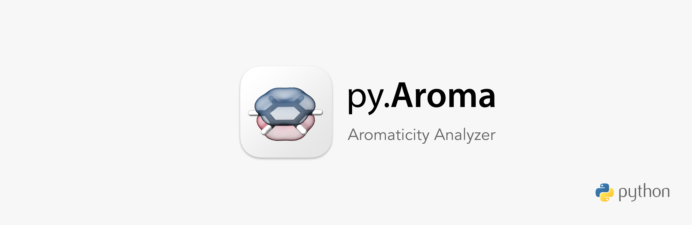

# py.Aroma

py.**Aroma** is a Python program for aromaticity analyses, including ICSS, NICS, HOMA analyses tool.

# Update History
## v1.0, 2021-08-29
1. Improved stability.
2. Typos are fixed in main program.
3. Running test has been finished on 7 platform.

## v0.6 Pre-release, 2021-08-28
HOMA calculation module has been added into main program. Please refer to [*HOMAcalc*](https://github.com/wongzit/HOMAcalc) for user manual now.

## v0.3 Pre-release, 2021-08-28
First release of *PyAroma*. The user manual is under preparing, for now please refer to the user manual of [*ICSSgen*](https://github.com/wongzit/ICSSgen), [*ICSScsv*](https://github.com/wongzit/ICSScsv), [*ICSSgen3D*](https://github.com/wongzit/ICSSgen3D), [*ICSScub3D*](https://github.com/wongzit/ICSScub3D) and [*NICSgen*](https://github.com/wongzit/NICSgen).
