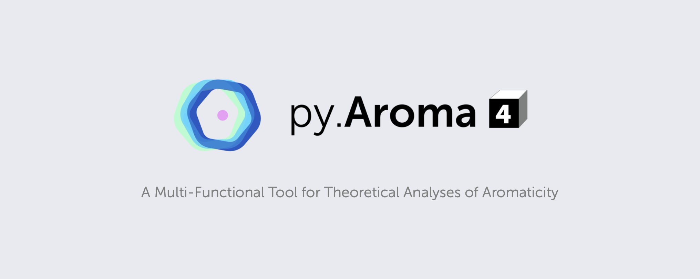

# py.Aroma 3

## Statement of Need
py.**Aroma** is a multi-functional Python program for aromaticity analyses.

Please refer to the [homepage](https://wongzit.github.io/program/pyaroma/) for more information, including user manual.

## Running with Source Code

Please run **pyAroma_main.py** file in **src** folder with Python 3.

## Download

**py.Aroma 3** Version: 3.0.0, Built on April 2nd, 2023.

- [macOS](https://drive.google.com/file/d/1-ugu20IhhebmjvPcV3EVS1pzLrYVGbal/view?usp=share_link)
- [Windows](https://drive.google.com/file/d/1QUojgzprZRvWLBtgcQ55pXqR8uX4vqRu/view?usp=share_link)
- [Linux](https://drive.google.com/drive/folders/12ukrOltMulc7Kz6ZV9--I7g9PDn8UeFL?usp=share_link)

## Update History

### v3.0.0, 2023-04-02
0. Fully re-wrote code.
1. Added BLA, HOMA and POAV functions.
2. Combined [*CSIgen*](https://github.com/wongzit/CSIgen) module.
3. Improved GUI by PyQt6.
4. Added more function for 2D and 3D NICS analyses.
5. Added 1D NICS scan function.
6. In 3D NICS module, user can also access 2D NICS module.

### v2.1.0, 2023-01-14
1. Bug fix.

### v2.0.1, 2022-08-04
1. Fixed the error: scientific notation of coordinates in input files.

### v2.0, 2022-07-29
1. BIG UPDATE: Now GUI is available for py.**Aroma**.
2. Removed HOMA calculation function.
3. Improved sufficiency of 2D-NICS ptting.
4. The user manual in this repo is for old version (v 1.x), please refer to [here](https://wongzit.github.io/program/pyaroma/) to find the user manual for new version.

### v1.0, 2021-08-29
1. Improved stability.
2. Typos are fixed in main program.
3. Running test has been finished on 7 platform.

### v0.6 Pre-release, 2021-08-28
HOMA calculation module has been added into main program. Please refer to [*HOMAcalc*](https://github.com/wongzit/HOMAcalc) for user manual now.

### v0.3 Pre-release, 2021-08-28
First release of *PyAroma*. The user manual is under preparing, for now please refer to the user manual of [*ICSSgen*](https://github.com/wongzit/ICSSgen), [*ICSScsv*](https://github.com/wongzit/ICSScsv), [*ICSSgen3D*](https://github.com/wongzit/ICSSgen3D), [*ICSScub3D*](https://github.com/wongzit/ICSScub3D) and [*NICSgen*](https://github.com/wongzit/NICSgen).
